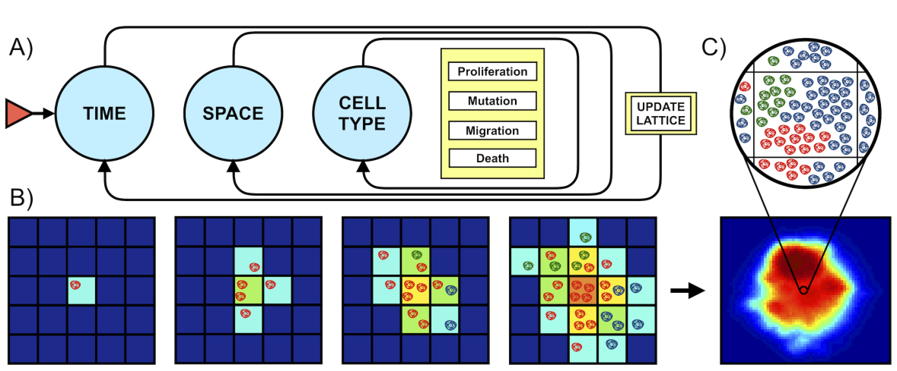
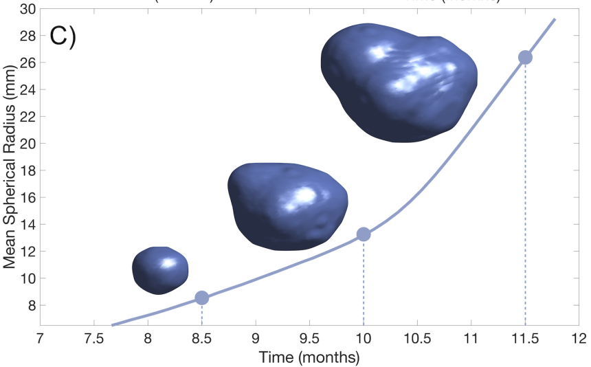
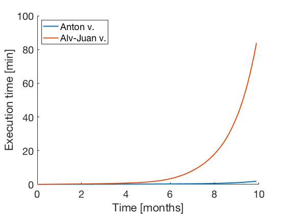
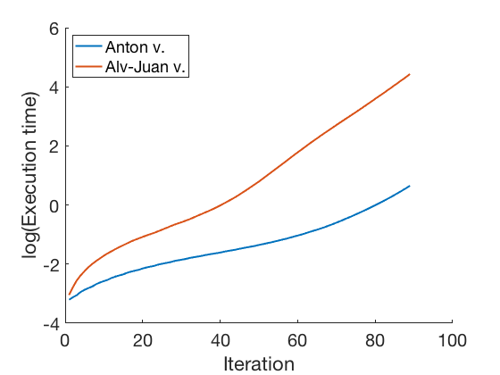

# Glioblastom Heterogenity Model

Biologically based mathematical model of glioblastoma - brain tumor - development over time.


Discrete mathematical model for neoplasm evolution modeling. Consists from *cellular automata* with 3D space grid. State of each cell is described by vector of parameters. Probabilistic cell state update rule model proliferation, mutation, migration, death events.

## Model overview




**A.** Basic algorithm (for implementation purposes). Initialization requires creating a 3D grid, specifying the final simulation
time, defining subpopulation traits and setting the initial state. Time iterations are then carried out until the final time is reached. At each time
step and each voxel, all clonal populations are updated. This updating involves calculating how many cells will proliferate, migrate, mutate or die.
When all populations at all voxels have been evaluated, all populations are updated synchronously.

**B.** Two-dimensional example of model
behaviour. Synchronous updating results in population increasing, diversifying and spreading at each time step, with probabilities computed
according to the biological rules. Compartment color indicates occupancy. Cell color indicates cell type. 

**C.** Bottom image is a slice of an actual
simulation, with colours indicating occupation. Each voxel contains a variable number of cells and subtypes as depicted above.

## 3D evolution visualization example



Example of tumor dynamics of the
Mean Spherical Radius and renderized 3D tumor shape for three different time points (8.5, 10, 11.5 months).

## My contributions

* model verification
* refactoring / debugging
* migration from Matlab to Julia
* performance optimization and parallelization




## Notes

This is supporting repo for submitted paper.

# The following is manual on Julia setup
## Julia language installation with Juno IDE

Prefereable way to work with code from current repo.

### Step 1 - Install Julia
Download Julia [here](https://julialang.org/downloads/) for your platform and install it following [platform specific instructions](https://julialang.org/downloads/platform.html)

### Step 2 - Install Juno
Follow [these instructions](https://docs.junolab.org/latest/man/installation/).


## Julia language with Jupyter Notebook installation on Mac

We may use Jupyter Notebook to run Julia code more interactively. After completing this tutorial you also would have installed and ready for work Python environment.

### Step 1 (approach 1) - install Jupyter Notebook with Anaconda - fastest way
Download and install [Anaconda](https://www.anaconda.com/distribution/). Congratulations! You have installed Jupyter Notebook. But if you do not want to download all Anaconda's packages battery... then second option is for you.

### Step 1 (approach 2) - install jupyter Notebook using pyenv/virtualenv - better way

Anaconda change system's default Python version + pre-installs a lot of packages. To avoid these unwanted consequences we may follow next steps:

1) Install [Homebrew](https://brew.sh/) package manager

```bash
/usr/bin/ruby -e "$(curl -fsSL https://raw.githubusercontent.com/Homebrew/install/master/install)"
```

2) Install [pyenv](https://alysivji.github.io/setting-up-pyenv-virtualenvwrapper.html):

```bash
brew update
brew install pyenv
```

Add the following line to `~/.bash_profile`:
```bash
eval "$(pyenv init -)"
```
Install Python via pyenv

```bash
pyenv install miniconda3-latest
```

3) Install [virtualenv](https://amaral.northwestern.edu/resources/guides/pyenv-tutorial) - tool for creating virtual environments

Install Git:

```bash
brew install git
```

Add your name (in example: Emma Paris) and e-mail (in example: eparis@atlassian.com):

```bash
git config --global user.name "Emma Paris"
git config --global user.email "eparis@atlassian.com"
```

4) Add `virtualenv` to your `pyenv` installation with the help of Git: 
```bash
git clone https://github.com/yyuu/pyenv-virtualenv.git ~/.pyenv/plugins/pyenv-virtualenv
```

5) Create folder(e.g. `virtual_env`) where we would keep Python virtual environments and go there:
```bash
mkdir virtual_env
cd virtual_env/
```
6) Create virtual environment(with the name `molab`, for example):
```bash
pyenv virtualenv miniconda3-latest molab
```
7) Activate created environment:
```bash
pyenv activate molab
```
8) Install Jupyter Notebook:
```bash
pip install --upgrade pip
pip install jupyter
```

### Step 2 - Install Julia language
Install [Julia](https://julialang.org/)
```bash
brew cask install julia
```

Add package to be able use Julia in Jupyter Notebook
```bash
julia
> using Pkg
> Pkg.add("IJulia")
> exit()
```

### Step 3 - launch Jupyter Notebook
1) Navigate with the help of `cd` command to the folder with `.ipynb` file
2) Activate virtual environment you have created e.g. with default settings:
```bash
pyenv activate molab
```
3) In browser launch necessary `.ipynb` file by clicking on it
4) After finishing work close browser tab with `.ipynb`
5) Stop process in terminal by clicking `Ctrl` + `c` and then `y`
5) Deactivate virtual environment - rollback your system to the default python version:
```bash
pyenv deactivate
```

### Step 4 - Julia tutorials

Complete list of tutorials may be found on [offisial page](https://julialang.org/learning/)

This is the [link](https://github.com/JuliaComputing/JuliaBoxTutorials) to GitHub repo of simple tutorial.

## Contributing
Pull requests are welcome. For major changes, please open an issue first to discuss what you would like to change.

Please make sure to update tests as appropriate.

## License
[MIT](https://choosealicense.com/licenses/mit/)
